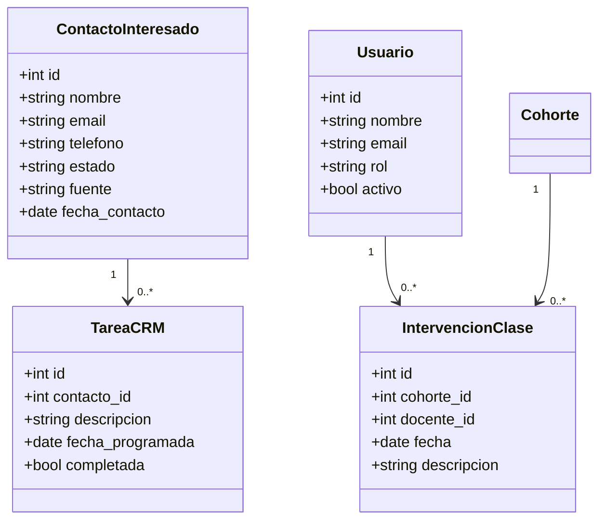

# 🧩 CRM e Intervenciones del Equipo

```mermaid
classDiagram
    class ContactoInteresado {
        +int id
        +string nombre
        +string email
        +string telefono
        +string estado
        +string fuente
        +date fecha_contacto
    }

    class TareaCRM {
        +int id
        +int contacto_id
        +string descripcion
        +date fecha_programada
        +bool completada
    }

    class Usuario {
        +int id
        +string nombre
        +string email
        +string rol
        +bool activo
    }

    class IntervencionClase {
        +int id
        +int cohorte_id
        +int docente_id
        +date fecha
        +string descripcion
    }

    ContactoInteresado "1" --> "0..*" TareaCRM
    Usuario "1" --> "0..*" IntervencionClase
    Cohorte "1" --> "0..*" IntervencionClase

```