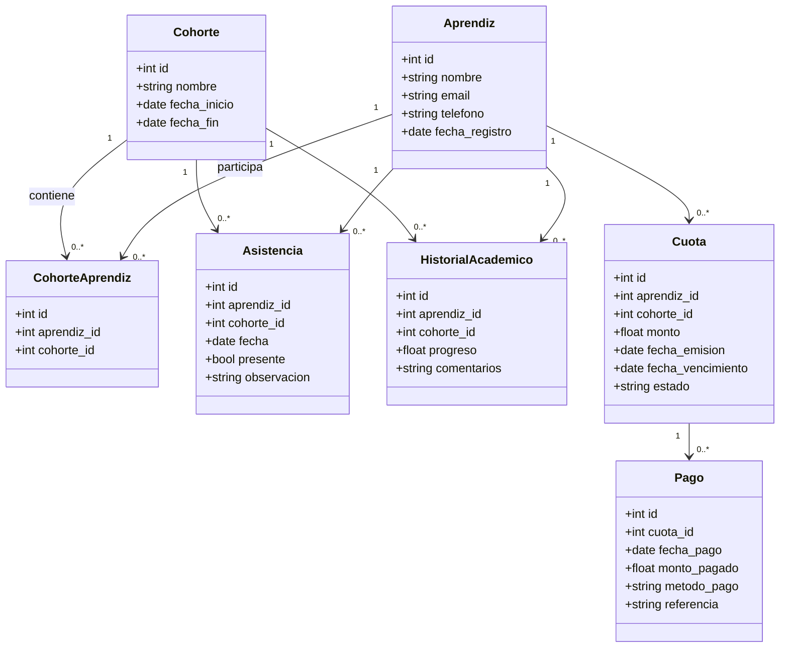

# 🎓 Gestión Académica y Administración

```mermaid
classDiagram
    class Aprendiz {
        +int id
        +string nombre
        +string email
        +string telefono
        +date fecha_registro
    }

    class Cohorte {
        +int id
        +string nombre
        +date fecha_inicio
        +date fecha_fin
    }

    class CohorteAprendiz {
        +int id
        +int aprendiz_id
        +int cohorte_id
    }

    class Asistencia {
        +int id
        +int aprendiz_id
        +int cohorte_id
        +date fecha
        +bool presente
        +string observacion
    }

    class HistorialAcademico {
        +int id
        +int aprendiz_id
        +int cohorte_id
        +float progreso
        +string comentarios
    }

    class Cuota {
        +int id
        +int aprendiz_id
        +int cohorte_id
        +float monto
        +date fecha_emision
        +date fecha_vencimiento
        +string estado
    }

    class Pago {
        +int id
        +int cuota_id
        +date fecha_pago
        +float monto_pagado
        +string metodo_pago
        +string referencia
    }

    Aprendiz "1" --> "0..*" CohorteAprendiz : participa
    Cohorte "1" --> "0..*" CohorteAprendiz : contiene
    Aprendiz "1" --> "0..*" Asistencia
    Cohorte "1" --> "0..*" Asistencia
    Aprendiz "1" --> "0..*" HistorialAcademico
    Cohorte "1" --> "0..*" HistorialAcademico
    Aprendiz "1" --> "0..*" Cuota
    Cuota "1" --> "0..*" Pago
```